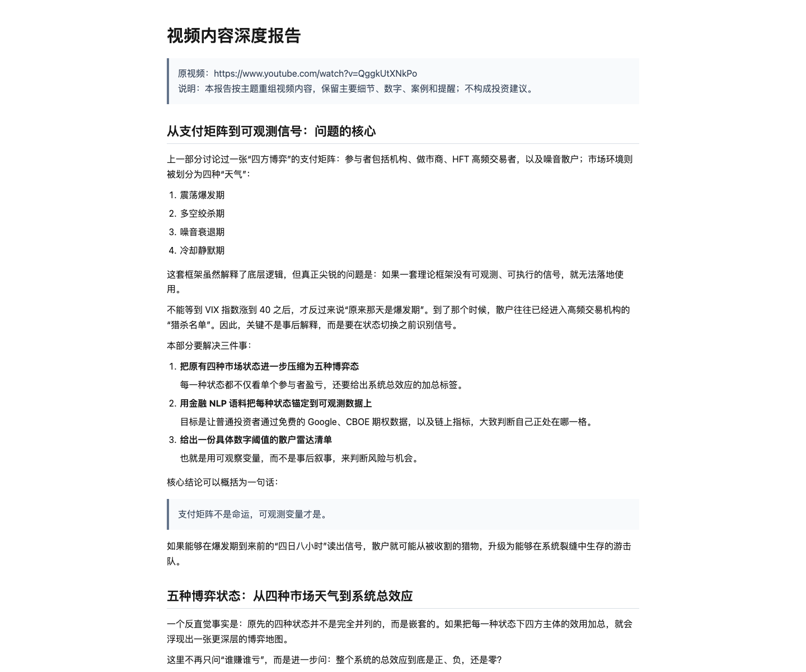

# Video Report Nemotron

Video Report Nemotron is a Hermes skill for turning video links or local media files into polished Markdown, HTML, and PDF reports. It uses platform subtitles first, falls back to Nemotron ASR only when needed, and places selected video frames near the sections where they actually help the explanation.

[中文文档](docs/README.zh-CN.md)



## Highlights

- Works with YouTube, local audio/video files, and other `yt-dlp` supported URLs when subtitles or media extraction are available.
- Uses existing subtitles before local ASR, keeping many URL reports fast and cheap.
- Uses Nemotron ASR only for subtitle fallback. The bundled local backend is Apple Silicon MLX with `mlx-community/nemotron-3.5-asr-streaming-0.6b-8bit`.
- Does not fall back to Whisper-family ASR. Other platforms can use subtitle-first reports today, but local ASR requires an explicit Nemotron backend.
- Generates timestamped transcript artifacts, reviewed frame manifests, OCR/vision notes, and final reader-facing reports.
- Captures visual evidence from URL sources by downloading a stable local video copy before `ffmpeg` frame extraction, then removes that temporary copy unless `--keep-video` is set.
- Renders existing Markdown reports with table, image, bold, inline-code, HTML, and PDF support through `video_render_markdown.py`.
- Can force the final output language independently from the source video language.
- Runs in Hermes CLI and Hermes Desktop when installed into the active Hermes skills directory.

## Example Output

This repository includes a generated report for a public YouTube video:

- [Markdown report](examples/QggkUtXNkPo/report.md)
- [HTML report](examples/QggkUtXNkPo/report.html)
- [PDF report](examples/QggkUtXNkPo/report.pdf)

The report embeds selected frames only where visual context supports the written analysis.


## Repository Layout

```text
.
├── skill/                      # Hermes skill package
│   ├── SKILL.md                # Skill instructions
│   ├── .env.example            # Runtime config template, no real keys
│   ├── references/             # YouTube/Bilibili/report quality diagnostics
│   ├── scripts/                # Download, ASR, visual, OCR, render scripts
│   └── tests/                  # Pytest coverage
├── docs/
│   ├── README.zh-CN.md         # Chinese documentation
│   └── assets/                 # README screenshots
└── examples/
    └── QggkUtXNkPo/            # Example final report artifacts
```

## Requirements

Common tools:

```bash
brew install ffmpeg imagemagick
npm install -g @run-llama/liteparse
playwright install chromium
```

Python environment:

```bash
uv venv .venv-nemotron --python 3.12
uv pip install --python .venv-nemotron/bin/python yt-dlp httpx pytest
```

Local ASR on Apple Silicon:

```bash
uv pip install --python .venv-nemotron/bin/python \
  "git+https://github.com/Blaizzy/mlx-audio.git"
```

Default local ASR model:

```text
mlx-community/nemotron-3.5-asr-streaming-0.6b-8bit
```

The model is downloaded through the Hugging Face cache on first use. On Linux or Windows, subtitle-first URL reports still work, but local ASR requires adding a concrete Nemotron backend; this project intentionally does not silently substitute Whisper.

## Configuration

Copy the template and set local values:

```bash
cp skill/.env.example skill/.env
```

`skill/.env.example` contains OpenAI-compatible settings for report composition and multimodal visual fallback:

```dotenv
OPENAI_BASE_URL=https://api.openai.com/v1
OPENAI_TEXT_MODEL=gpt-4.1-mini
OPENAI_VISION_MODEL=gpt-4.1-mini
OPENAI_API_KEY=
REPORT_LANGUAGE=auto
ASR_BACKEND=auto
MLX_ASR_MODEL=mlx-community/nemotron-3.5-asr-streaming-0.6b-8bit
```

Use any OpenAI-compatible endpoint by changing `OPENAI_BASE_URL` and model names. Never commit a real API key.

## Quick Start

Generate the transcript/metadata artifact:

```bash
.venv-nemotron/bin/python skill/scripts/video_report.py \
  "https://www.youtube.com/watch?v=QggkUtXNkPo" \
  --transcript-source auto \
  --asr-backend auto \
  --language zh-CN \
  --output-dir reports/QggkUtXNkPo \
  --chunk-seconds 90
```

`--transcript-source auto` tries platform subtitles first. If no subtitles are available, it extracts audio and uses the selected Nemotron backend.

To force local ASR:

```bash
.venv-nemotron/bin/python skill/scripts/video_report.py ./video.mp4 \
  --transcript-source asr \
  --asr-backend auto \
  --language en-US \
  --output-dir reports/local-video
```

## YouTube Access Strategy

This section is specifically for YouTube. It is not the general strategy for local files, Bilibili, or other `yt-dlp` sources.

YouTube increasingly blocks anonymous extraction with bot checks, playback-integrity checks, or PO-token/player challenges. Common symptoms include `Sign in to confirm you're not a bot`, repeated player JavaScript `IncompleteRead` errors, `n challenge solving failed`, or format lists that contain only storyboard entries such as `sb0`/`sb1`. In those cases, do not treat the video title, description, recommendations, ads, or live chat as the spoken content.

Use this order:

1. Try subtitles/captions first, with browser or exported cookies when the video requires a logged-in session:

```bash
yt-dlp --cookies-from-browser safari --no-playlist --list-subs --ignore-no-formats URL
yt-dlp --cookies cookies.txt --no-playlist --list-subs --ignore-no-formats URL
```

2. If cookies work but no captions exist, use a local audio/video file and run the normal ASR path.
3. If YouTube exposes metadata but not playable media formats, try a small number of `yt-dlp` player/client diagnostics, then stop. Do not loop indefinitely trying random extractor settings.
4. If extraction still returns only metadata or storyboard formats, ask for a copied transcript, a local media file, or a working exported `cookies.txt`. Only produce a metadata-only report when the user explicitly asks for one.

Detailed YouTube diagnostics are in [skill/references/youtube-cookies-po-token.md](skill/references/youtube-cookies-po-token.md), and the hardened YouTube workflow is in [skill/references/youtube-video-report-hardening.md](skill/references/youtube-video-report-hardening.md).

## Stable Video Frame Capture

`video_capture_frames.py` downloads URL video sources to a stable local MP4 before running `ffmpeg` frame extraction. This avoids fragile direct `googlevideo.com` signed URLs, TLS EOF failures, and expired streaming URLs during seek-heavy frame capture. The temporary video is deleted after frames are captured unless `--keep-video` is passed.

```bash
.venv-nemotron/bin/python skill/scripts/video_capture_frames.py \
  reports/QggkUtXNkPo/visual/visual_manifest.json \
  -o reports/QggkUtXNkPo/visual/visual_manifest.frames.json \
  --frames-dir reports/QggkUtXNkPo/visual/frames \
  --download-dir reports/QggkUtXNkPo/visual/source_video \
  --overwrite
```

Use `--keep-video` when you need an auditable local video artifact. Use `--no-download` only when you explicitly want the old direct-stream behavior.

## Final Report Pipeline

`video_report.py` creates an intermediate transcript artifact. For a user-facing report, run the visual pipeline and final composer:

```bash
# 1. Review transcript blocks and decide which ones need video evidence.
.venv-nemotron/bin/python skill/scripts/video_visual_manifest.py \
  reports/QggkUtXNkPo/QggkUtXNkPo.json \
  -o reports/QggkUtXNkPo/visual/visual_manifest.json

# 2. Capture frames only for reviewed blocks.
.venv-nemotron/bin/python skill/scripts/video_capture_frames.py \
  reports/QggkUtXNkPo/visual/visual_manifest.json \
  -o reports/QggkUtXNkPo/visual/visual_manifest.frames.json \
  --frames-dir reports/QggkUtXNkPo/visual/frames

# 3. Run OCR on frames.
.venv-nemotron/bin/python skill/scripts/video_ocr_frames.py \
  reports/QggkUtXNkPo/visual/visual_manifest.frames.json \
  -o reports/QggkUtXNkPo/visual/visual_manifest.ocr.json \
  --ocr-dir reports/QggkUtXNkPo/visual/ocr

# 4. Use multimodal fallback only when OCR is weak.
.venv-nemotron/bin/python skill/scripts/video_multimodal_frames.py \
  reports/QggkUtXNkPo/visual/visual_manifest.ocr.json \
  -o reports/QggkUtXNkPo/visual/visual_manifest.vision.json \
  --env-file skill/.env \
  --analysis-language auto

# 5. Compose final reader-facing Markdown, HTML, and PDF.
.venv-nemotron/bin/python skill/scripts/video_compose_final_report.py \
  reports/QggkUtXNkPo/QggkUtXNkPo.json \
  reports/QggkUtXNkPo/visual/visual_manifest.vision.json \
  --markdown reports/QggkUtXNkPo/visual/report.md \
  --html reports/QggkUtXNkPo/visual/report.html \
  --pdf reports/QggkUtXNkPo/visual/report.pdf \
  --env-file skill/.env \
  --report-language zh-CN
```

Use `--report-language en`, `--report-language zh-CN`, or another language tag to force the final report language. The composer validates obvious language mismatches and retries once when provider output ignores the requested language.

## Render Existing Markdown

Use `video_render_markdown.py` when you already have a Markdown report or fact-check addendum and only need robust HTML/PDF rendering. It reuses the skill renderer so tables, images, bold text, inline code, and relative image paths survive the HTML/PDF step.

```bash
.venv-nemotron/bin/python skill/scripts/video_render_markdown.py \
  reports/QggkUtXNkPo/visual/report.md \
  --html reports/QggkUtXNkPo/visual/report.html \
  --pdf reports/QggkUtXNkPo/visual/report.pdf \
  --title "QggkUtXNkPo Report"
```

For report quality checks, see [skill/references/report-quality-pitfalls.md](skill/references/report-quality-pitfalls.md).

## Hermes CLI

Install the skill:

```bash
mkdir -p ~/.hermes/skills/media
rsync -a skill/ ~/.hermes/skills/media/video-report-nemotron/
```

Ask Hermes for a final report:

```text
Use video-report-nemotron to analyze https://www.youtube.com/watch?v=QggkUtXNkPo.
Generate final Markdown, HTML, and PDF report in Simplified Chinese.
```

## Hermes Desktop

Hermes Desktop can use the same skill if installed into the desktop backend's active `HERMES_HOME`.

For the default local home:

```bash
mkdir -p ~/.hermes/skills/media
rsync -a skill/ ~/.hermes/skills/media/video-report-nemotron/
```

If you run Desktop from a Hermes source checkout with a different `HERMES_HOME`, install into that home instead. After installing, use `/reload-skills` in Desktop or restart the app.

Desktop prompt example:

```text
Use video-report-nemotron to analyze this video:
https://www.youtube.com/watch?v=QggkUtXNkPo

Generate a rich final report with appropriate images.
Output Markdown, HTML, and PDF.
Force report language English.
```

## Testing

```bash
.venv-nemotron/bin/python -m pytest skill/tests
```

Tests cover subtitle source behavior, Nemotron-only backend selection, language forcing, visual manifest selection, environment loading, report composition, and Markdown-to-HTML/PDF rendering behavior.

## Security Notes

- Real `.env` files are ignored.
- Media downloads and normalized audio/video files are ignored.
- The example report is included as a small reproducible artifact; raw downloaded media and model weights are not committed.
- Public video content may still be subject to source platform terms and copyright. Use this tool only on content you are allowed to process.
