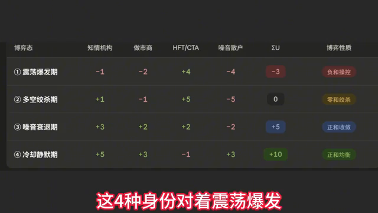
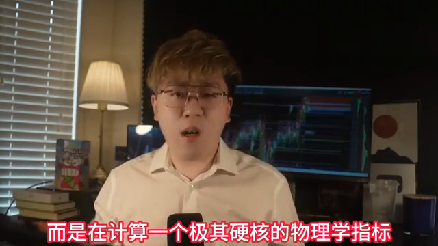
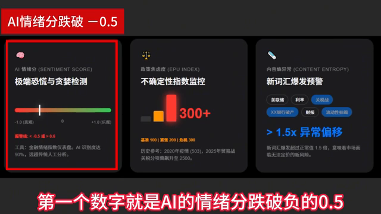
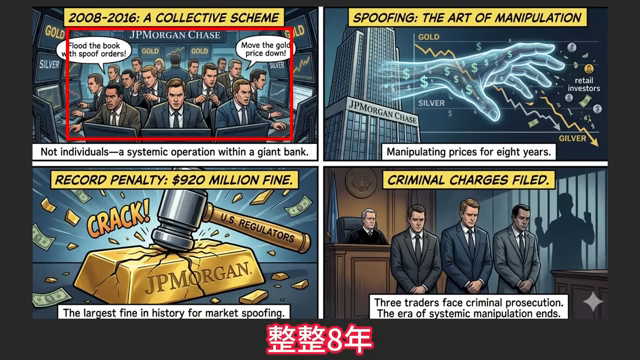
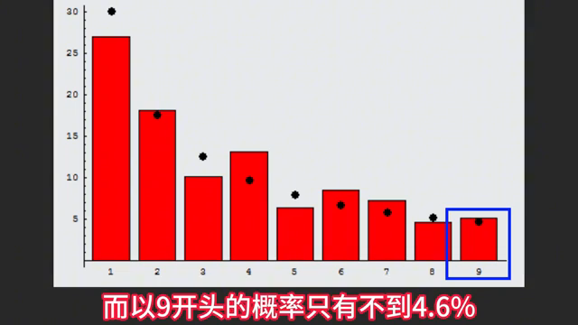
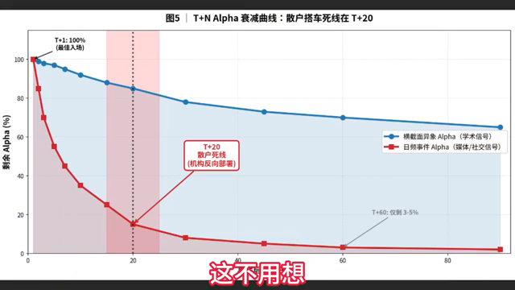

# 视频内容深度报告

> 原视频：https://www.youtube.com/watch?v=QggkUtXNkPo
> 说明：本报告按主题重组视频内容，保留主要细节、数字、案例和提醒；不构成投资建议。

## 从支付矩阵到可观测信号：问题的核心

上一部分讨论过一张“四方博弈”的支付矩阵：参与者包括机构、做市商、HFT 高频交易者，以及噪音散户；市场环境则被划分为四种“天气”：

1. 震荡爆发期
2. 多空绞杀期
3. 噪音衰退期
4. 冷却静默期

这套框架虽然解释了底层逻辑，但真正尖锐的问题是：如果一套理论框架没有可观测、可执行的信号，就无法落地使用。

不能等到 VIX 指数涨到 40 之后，才反过来说“原来那天是爆发期”。到了那个时候，散户往往已经进入高频交易机构的“猎杀名单”。因此，关键不是事后解释，而是要在状态切换之前识别信号。

本部分要解决三件事：

1. **把原有四种市场状态进一步压缩为五种博弈态**
   每一种状态都不仅看单个参与者盈亏，还要给出系统总效应的加总标签。

2. **用金融 NLP 语料把每种状态锚定到可观测数据上**
   目标是让普通投资者通过免费的 Google、CBOE 期权数据，以及链上指标，大致判断自己正处在哪一格。

3. **给出一份具体数字阈值的散户雷达清单**
   也就是用可观察变量，而不是事后叙事，来判断风险与机会。

核心结论可以概括为一句话：

> 支付矩阵不是命运，可观测变量才是。

如果能够在爆发期到来前的“四日八小时”读出信号，散户就可能从被收割的猎物，升级为能够在系统裂缝中生存的游击队。

## 五种博弈状态：从四种市场天气到系统总效应

一个反直觉事实是：原先的四种状态并不是完全并列的，而是嵌套的。如果把每一种状态下四方主体的效用加总，就会浮现出一张更深层的博弈地图。

这里不再只问“谁赚谁亏”，而是进一步问：整个系统的总效应到底是正、负，还是零？

### 震荡爆发期：复合操控态，系统总效应为负

在震荡爆发期，各方效用大致为：

| 参与者 | 效用 |
|---|---:|
| 机构 | -7 |
| 做市商 | -5 |
| HFT 高频交易者 | +13 |
| 散户 | -4 |
| 系统总效应 | -3 |

这一状态并不是零和博弈，而是**复合操控态**。

HFT 通过点火与收割获利，但烧掉的是整个系统的流动性。可以把它理解为：系统里几乎每个人都在流血，只有一个穿着“隐身衣”的吸血者在获利。

这类状态的本质是：高频交易者利用速度、结构和流动性缺口获利，而其他参与者承受整体流动性恶化带来的损失。

### 多空绞杀期：零和绞杀，赢家收入等于输家流出

在多空绞杀期，各方效用大致为：

| 参与者 | 效用 |
|---|---:|
| 机构 | +1 |
| 做市商 | -1 |
| HFT 高频交易者 | +5 |
| 散户 | -5 |
| 系统总效应 | 0 |

这是一个非常典型的**零和绞杀态**。

在这种状态下，机构和高频交易系统赚到的每一分钱，几乎都精确对应着做市商与散户口袋里流出的钱。系统整体没有创造新增价值，只是在参与者之间重新分配损益。

一个典型案例是 2021 年 1 月的 GameStop（GME）事件。

2021 年 1 月 28 日，Robinhood 停止买入的那一刻，就是多空绞杀的教科书案例。GME 股价从 483 美元一路崩盘到 112 美元。散户的买入流动性被限制，导致多头力量被直接压死。

这一案例说明：当散户一侧的流动性通道被切断时，即便此前情绪和价格都极端强势，也可能迅速进入绞杀状态。

### 噪音衰退期：正和的手冷态，散户情绪调整最慢

在噪音衰退期，系统合计效用为：

| 状态 | 系统总效应 |
|---|---:|
| 噪音衰退期 | +5 |

这是一个**正和的手冷态**。

在这个阶段，多方都在慢慢填补此前高分歧、高波动带来的红利，只有散户仍可能继续割肉。原因在于，散户的情绪调整速度通常比机构慢整整 **10 到 20 个交易日**。

这也对应一句判断：

> 最后一个被屠宰的，往往就是最乐观的。

也就是说，当市场已经进入噪音衰退、波动与情绪开始降温时，机构可能已经完成风险控制和仓位调整，而散户却仍沉浸在上一阶段的情绪惯性里，继续以错误节奏交易。

### 冷却静默期：正和均衡态，机构进行重要筹码收集

在冷却静默期，合计效用为：

| 状态 | 系统总效应 |
|---|---:|
| 冷却静默期 | +10 |

这是一个**正和均衡态**。

这个阶段看似死水一潭，但反而可能是机构最重要的布局阶段。此时：

- 高频交易者反而可能成为输家；
- 因为市场里已经“无肉可吃”；
- 噪音流消失；
- 算法失去猎物；
- 机构却可能在低波动、低关注的环境中完成筹码收集。

如果散户足够聪明，在这个阶段的左侧前幅，就可能与机构同车。

需要特别注意的是：机构在这个阶段的效用为 **+5**，是所有机构状态中最高的。这意味着，机构可能正在看似平静的市场中完成最重要的筹码收集。

### 系统性崩溃态：爆发态的极端版本，四方全亏

第五种状态是**系统性崩溃态**。它不在原本四种状态里，但可以理解为震荡爆发期的极端版本。

典型案例包括：

- 2008 年金融危机；
- 2020 年 3 月新冠疫情冲击；
- 2022 年 LUNA 崩盘。

这是一种四方全亏的状态。其特征包括：

- VIX 直接突破 40；
- 某类尾部风险或分布指标的 CDF 直接接近或超过 0.99；
- 连高频交易者也需要撤退；
- 因为流动性蒸发到连算法都无法继续收割。

一个标志性数字是：

> 2020 年 3 月 16 日，VIX 单日收盘达到 82.69。

这是自 1990 年 VIX 诞生以来的最高点。那一刻，整个市场没有真正的赢家，只有尚未被清算的输家。

## 支付矩阵真正衡量的是系统总效应

支付矩阵表面上是在看谁赚谁亏，但更深层的问题是：

> 系统总效应到底是正的，还是负的？

如果系统总效应为负，个体就可能只是燃料；如果系统总效应为正，参与者才有机会。

因此，关键不是记住某个抽象分类，而是知道自己处在五种博弈状态中的哪一格。要做到这一点，必须依靠可观测的外部证据，而不是事后叙事。

## 语言领先价格：金融文本中的可观测证据

最硬核的一套证据，藏在新闻和社交媒体语料里。

过去十年，金融学界对这条研究线的研究越来越深入，结论也非常一致：

> 语言先动，价格后动。

也就是说，市场叙事、新闻语言和社交媒体情绪，往往会先于价格变化出现结构性变化。

### 2024 年芝加哥大学团队实验

2024 年有一个非常有意思的实验：芝加哥大学团队把《华尔街日报》从 **1984 年到 2017 年** 的 **80 万篇文章**，整理成 **182 个话题**，然后研究这些金融文章与价格变动之间的解释力。

结论非常明确：

> 仅靠新闻，就能够解释 **25%** 的股票市场收益波动。

这意味着，在完全不看任何价格数据的前提下，只凭语言数据，就能抓住约四分之一的行情变化。

换句话说，金融新闻和市场语言不是价格的附属品，而可能是价格变化前的重要先行变量。

例如，2001 年 9 月，《华尔街日报》中某类相关内容占比达到 **4.5%**。这一类语言信号本身，就可能包含了市场状态切换前的关键信息。

*图 1：曲线或指标图、矩阵/状态框架、表格或阈值清单。这张图包含可读的曲线或指标图、矩阵/状态框架、表格或阈值清单，对应本节讨论的画面信息。*

## 文本信号与市场系统性崩溃的切换

当新闻文本的主题高度集中到同一类重大风险事件上，例如“恐怖主义”主题时，市场可能已经不再处于普通波动状态。这里提到的关键文本证据是：**主题吸引度的 KL 散度冲击到 95 分位**。

这意味着，新闻主题分布已经明显偏离常态，市场叙事从分散的日常信息，突然收敛到某一个高风险主题上。这个时刻可以被视为市场从常态切换到系统性崩溃状态的文本证据之一。

核心问题在于：有没有一种指标，能够在股灾真正降临之前提前拉响警报？

## “新新闻就是坏新闻”：用神经网络监控世界的陌生程度

2023 年，顶尖计量学者 GOSM 和 MAMSK 发表了一篇在量化宏观圈引起广泛关注的论文。论文标题非常反直觉，叫作 **“New News Is Bad News”**，也就是“新的新闻就是坏新闻”。

这项研究没有研究 K 线，也没有研究财报，而是使用 AI 神经网络，例如 RNN，全天 24 小时不间断地阅读全球财经新闻。

研究者关注的重点并不是简单判断新闻是利好还是利空，而是计算一个更底层、更偏物理学含义的指标：**条件信息熵**。

用通俗语言解释，信息熵衡量的是：**这个世界正在发生的事情有多“前所未见”**。

- 如果最近的新闻被 AI 扫描后发现都是老生常谈、都在预料之内，那么信息熵就会很低，市场相对安全。
- 但如果某个时段新闻突然密集爆发，而且组合方式连 AI 都觉得“这个剧本以前没见过”，信息熵就会瞬间爆表。

论文基于庞大的历史数据得出一个非常重要的结论：

> 只要新闻的信息熵上升 1 个标准差，它不仅意味着短期震荡，更直接预示未来整整一年，大盘可能会被压制在熊市状态中。

背后的逻辑是：传统坏消息通常可以被市场提前消化，但前所未见的新格局，会让人类投资者的大脑和机构交易算法同时陷入“当机”状态。巨大的不确定性会让大资金优先做一件事：**不计成本地清仓撤退**。

因此，当散户还在盯着均线找支撑，传统交易员还在看 VIX 衡量恐慌时，真正顶级的劣势识别者已经在用超级算力监控整个世界的“陌生程度”。

在这个被机器主导的市场环境里，一个重要判断是：

> 最大的利空不是坏消息，而是前所未见的新消息。

## 三个市场报警器：情绪分、政策焦虑度与风险状态

将前面的文本主题集中度、新闻信息熵和市场状态指标串联起来，可以得到四种博弈状态下的 LP 指纹，也就是 **LP 指标与市场状态之间的映射确认图**。

更实用地说，可以重点记住三个数字。它们相当于给市场安装了三个报警器。

### 报警器一：AI 情绪分跌破 -0.5，代表极度恐慌

第一个关键数字是：**AI 情绪分跌破 -0.5**。

现在有很多专门读取财经新闻的 AI 工具，会把每天的财经新闻阅读一遍，然后给出一个情绪分：

- 最乐观是 **+1**
- 最悲观是 **-1**

需要记住的阈值是：

- 当情绪分跌到 **-0.5 以下**，代表极度恐慌；
- 当情绪分涨到 **+0.6 以上**，代表极度乐观。

这类 AI 已经能够比较精准地识别新闻情绪，正确率大约在 **90% 以上**，比过去人工翻词典、靠词表判断情绪的方法准确得多。

可查询的免费工具叫作 **金融情绪指数**。在常见财经网站上搜索，用手机也可以随手查到。

### 报警器二：政策焦虑度超过 200 是紧张，超过 300 是危机

第二个关键数字是：**政策焦虑度超过 200，意味着紧张；超过 300，意味着危机**。

有一批美国学者设计了一个非常实用的指标，叫作 **政策焦虑度指数**。它的基本思路很简单：每天读取主要大报纸，统计其中有多少篇文章在讨论“政策不确定性”。

这个指标本质上是在衡量市场和社会对于政策变化、政策不确定、监管变化等问题的焦虑程度。

关键阈值是：

- **超过 200**：市场进入紧张状态；
- **超过 300**：市场进入危机状态。

*图 3：曲线或指标图。这张图包含可读的曲线或指标图，对应本节讨论的画面信息。*

## 新闻语言与市场风险预警信号

### 经济风险类话题数量指数：从紧张到危机的阈值

衡量市场紧张程度时，可以观察经济风险相关话题在新闻中的出现数量。相关话题越多，指数越高。

这个指数有几个重要参照：

- 历史极限约为 **100**；
- 超过 **200**，就意味着市场进入**显著紧张**状态；
- 超过 **300**，就已经属于**严重危机**。

典型案例包括：

- **2020 年 3 月**，武汉疫情最严重、全球金融市场高度恐慌时，这一数字曾达到 **503**。
- 到了 **2025 年 4 月**，也就是特朗普“解放日”关税冲击当天，贸易政策相关的风险指数直接冲到 **2000 多点**，约为正常值的 **25 倍**，也是历史最高水平。

这说明，当特定经济风险主题在新闻中爆发式增长时，往往对应着市场正在经历非常异常的压力状态。

### 新闻内容“突然大变”：新词组合超过正常水平 1.5 倍

另一个预警信号，是新闻内容本身突然发生剧烈变化。这个指标相对抽象，可以理解为：在正常时期，财经新闻头条通常围绕一些固定主题展开，例如：

- 美联储；
- 财报；
- 利率；
- 资金充足性等。

但如果某一天新闻中突然大量出现过去很少见、甚至从未见过的新词汇、新组合，例如“某某银行倒闭”这类异常表达，就意味着新闻语言结构发生了突变。

如果这种“新词汇、新组合”的爆发程度超过正常水平的 **1.5 倍**，就构成一个非常显著的风险预警信号。

### 2007 年“房利美 + 风险”信号：提前 20 个月响起警报

一个非常典型的案例出现在 **2007 年 1 月**。当时，美国财经新闻中“房利美 + 风险”这一组合突然大量出现。

而真正被视为金融危机爆发标志的事件——**雷曼兄弟倒闭**，发生在 **2008 年 9 月**。

也就是说，新闻语言在危机真正爆发前大约 **20 个月**，就已经吹响了警报。只是当时并没有多少人真正理解这个信号的含义。

### 重要限制：语言只能印证状态，不能预测涨跌

需要特别强调的是，新闻语言和语义指标只能帮助判断“当下市场处于什么状态”，不能直接替代投资决策，更不能可靠预测未来价格涨跌。

一个很典型的例子，是前两年很多人迷信用 ChatGPT 读新闻、再根据新闻情绪选股。这类策略在早期确实有不错效果：

- 如果在 **2021 年末**使用类似策略，收益率可能会明显跑赢大盘；
- 到了 **2022 年**，策略效果开始下滑；
- **2023 年**又进一步下降；
- 到了 **2024 年上半年**，效果基本已经接近“闭着眼买”，与随机买入没有太大区别。

原因很简单：当市场上越来越多人都知道可以用 AI 读新闻炒股时，这个策略就不再灵了。

金融市场中，一个套路只要被足够多人知道、资金大量涌入，它的超额收益就会被迅速吞噬。因此，现在很多新闻并不只是写给普通投资者看的，也是在写给 AI、量化模型和数据系统看的。

## 市场操控：有人作弊，而且手法有迹可循

### 正常动荡与人为操控的区别

很多散户长期不理解的一点是：市场上确实存在操控行为，而且一些操控手法是有迹可循的。

正常情况下，市场动荡大概持续几个小时就会过去。但如果背后有人使用基础操控手段，向市场中投放虚假订单或诱导性订单，这种动荡可能会被人为拉长：

- 短则持续几天；
- 长则持续几周。

### 案例一：Coscia 欺骗交易案

美股历史上最著名的操控案件之一，是 **Coscia 欺骗交易案**。这个案子发生在 **2013 年**，其操作方式并不复杂，但非常典型。

他在 **2011 年 8 月到 10 月**这两个月里，在市场上使用了一种“假动作”：

1. 先挂出一个大单，假装要大量买入或卖出；
2. 让其他自动化交易程序误以为市场出现大单扫货或大单抛售；
3. 诱导其他量化程序跟单，形成羊群效应；
4. 随后迅速撤单；
5. 再用小单反向交易，把跟风者割掉。

这种手法就是典型的 **spoofing（欺骗交易）**。

可以用一个菜市场的比喻来理解：一个人假装要大批购买大白菜，菜贩看到需求很大，就把菜都搬过来。结果这个人转身走了，同时用另一个身份低价把菜买走。

这一案件的处罚也非常明确：

- 美国监管机构对其罚款 **280 万美元**；
- 英国监管部门又追加罚款 **60 万英镑**；
- 本人还被判入狱 **3 年**。

这是历史上第一个欺骗交易定罪案。自此以后，这类玩法从灰色地带变成了明确的联邦重罪。

### 案例二：2010 年相关操控案件

另一个重要案件发生在 **2010 年**。这一案例同样属于美股历史上重要的市场操控事件，但相关细节将在后续内容中展开。

*图 4：曲线或指标图、表格或阈值清单。这张图包含可读的曲线或指标图、表格或阈值清单，对应本节讨论的画面信息。*

## 典型操纵案例：从个人程序到大型银行集体作案

### 伦敦交易员 Sarao 与 2010 年美股“闪电崩盘”

一个典型案例的主角，是英国交易员 Navinder Sarao。其形象并不像传统意义上的华尔街巨头，而是住在伦敦普通房子里的“宅男”式交易者。

他研究出一套虚假挂单程序，通过程序化方式长期制造虚假订单，持续操作了五年、覆盖四百多个交易日，获利四千多万美元。

最离谱的节点发生在 2010 年 5 月 6 日。当日美股在 36 分钟内蒸发了约 1 万亿美元市值，即著名的“闪电崩盘”。在这一过程中，Sarao 挂出的虚假订单一度占到卖方总量的四成左右。

这起事件揭示了一个关键问题：市场微观层面的操控，可能引发宏观层面的连锁雪崩。一个人在伦敦房间里通过电脑敲出的订单，竟然能成为全球股民恐慌性下跌的重要诱因之一。

### 摩根大通贵金属操纵案：从个人行为升级为机构性作案

另一个著名案例是摩根大通贵金属市场操纵案。与 Sarao 案不同，这起案件的性质发生了变化：它不是个人作案，而是大型银行内部的集体性、系统性作案。

从 2008 年到 2016 年，长达八年时间里，摩根大通内部有 15 名交易员，在黄金、白银等贵金属市场中系统性进行虚假挂单和幌骗交易。

最终，美国司法部门对摩根大通开出 9.2 亿美元罚单，这也是相关领域中极高金额的处罚之一。更严厉的是，其中三名交易员被刑事起诉，而且适用的是通常用于打击黑帮和有组织犯罪的法律工具。

这说明，虚假挂单并非只存在于边缘市场或小型交易者之间。即便是大型金融机构，也可能通过组织化方式参与市场操纵。

## 加密市场中的刷量与操纵：监管缺位下的放大版问题

### 加密交易所大量成交量可能是假的

如果说美股中的操纵已经足够离谱，那么加密市场的问题更严重。

有学者专门做过统计：在缺乏有效监管的加密货币交易所中，平均 70% 以上的成交量可能是假的。每年被“洗”出来的虚假交易量，规模以万亿美元计。

这些虚假交易量的主要目的，是制造市场繁荣、流动性充足、交易活跃的幻觉，从而吸引散户进场跟单。

### 用本福特定律识别异常成交数据

识别虚假成交量的方法之一，是利用“本福特定律”，也叫“第一数字定律”。

在真实世界的自然数据中，例如：

- 财务报表；
- 国家人口；
- 物理常数；
- 各大河流长度；

数字的首位并不是平均分布的，而是呈现出非常稳定的规律：

- 以数字 1 开头的概率约为 30.1%；
- 以数字 2 开头的概率约为 17.6%；
- 以数字 9 开头的概率不到 4.6%。

整体上，这些首位数字会形成一条平滑下降的对数曲线。

如果某个交易所的交易数字中，以 1 或 5 开头的比例超过 40%，就高度可疑，基本可以判断存在刷量行为。换句话说，在许多加密交易所中，看似热闹的成交数字，可能有超过一半都是人为制造的幻觉。

## 稳定币流入与加密牛市涨幅：不到 1% 的时间解释大量上涨

还有一个更加精巧的案例与稳定币 USDT 有关。

有人发现，USDT 大量流入市场的时间，占全部交易时间不到 1%。但这些极少数时间点，却解释了：

- 比特币约一半的涨幅；
- 其他主流加密货币约 64% 的涨幅。

更异常的是，这些买盘总是精准地出现在整数价位下方约 50 到 200 美元的位置。

这意味着，加密市场的上涨并不一定完全来自自然买盘。一种可能的机制是：在极短时间内，通过稳定币集中买入，在关键价位附近制造支撑和突破，从而推动整轮牛市中的大部分涨幅。

也就是说，一个操作时间不到 1% 的“印钞机”式资金流入，再加上集中买入动作，可能制造出整轮牛市一半左右的涨幅。

## 散户识别市场操纵的雷达信号

### 雷达一：大单突然出现又迅速撤掉

如果在订单簿一侧，突然出现一个比另一侧大三倍的大单，但不到三秒就消失，这就是典型的虚假挂单信号。

这类行为的目的通常不是成交，而是影响其他交易者对供需关系的判断，让市场误以为某一侧存在强大买压或卖压。

### 雷达二：撤单量超过成交量 50 倍以上

正常交易中，挂单与成交之间应当存在相对合理的比例。

如果某个市场中的挂单数量无缘无故远远超过成交数量，尤其是撤单量达到成交量 50 倍以上，就属于警报级别的异常信号。

这意味着大量订单可能只是用来制造市场深度假象，并没有真实成交意图。

### 雷达三：成交数字的首位分布不符合规律

如果某个交易所的数据中，成交数字以 1 或 5 开头的比例超过 40%，就高度可疑，可能存在刷量。

这一判断来自本福特定律。真实自然形成的数据首位数字通常会呈现稳定下降曲线，而人为制造的数据往往会破坏这种规律。

### 雷达四：成交量集中在整数价位

另一个需要警惕的信号，是成交量异常集中在整数价位附近。

尤其是在加密市场中，如果大量买盘总是集中出现在整数关口下方，例如距离整数价位 50 到 200 美元的位置，就可能不是自然交易行为，而是有意在关键心理价位附近制造支撑、引导突破或诱导散户跟进。

*图 6：案例材料、订单簿/交易数据、表格或阈值清单。这张图包含可读的案例材料、订单簿/交易数据、表格或阈值清单，对应本节讨论的画面信息。*

## 识别操控与拉盘砸盘的关键特征

### 整数价位成交异常：疑似非真实交易

在人为操控或“假交易”中，价格往往会集中出现在整数位附近，例如 1、5、10 这类整数字段。

如果某个品种的成交量中，整数价位成交占比超过 **15%**，这通常就是人为痕迹，绝对不像是真实自然交易形成的分布。

### 小市值币、群组狂推、分钟级成交量暴增：拉盘砸盘骗局的“黄金三元组”

一个经过检验有效的识别特征是：

1. **小市值币**；
2. **被群组集中喊单或狂推**；
3. **分钟级成交量突然暴增**。

这三者叠加，是识别拉盘砸盘骗局的“黄金三元组”。

例如，一个 **10 日交易量不到 5000 万美元**的小币，突然被某个 **Telegram 群**疯狂推广，同时 **1 分钟成交量达到平时的 80 到 100 倍**。这种盘面通常会在 **90 秒内见顶并翻转**。

### 稳定币大笔流入 + 整数关口下方集中买入：加密市场牛市起点信号

另一类重要信号是：

- 稳定币出现大笔流入；
- 同时在整数价位下方出现集中买入。

这通常是加密市场牛市起点的特征之一。

如果某一天看到 **UST/稳定币有几十亿级别资金疯狂涌入交易所**，同时比特币价格在某个 **整数关口下方**出现大笔买单，那么大概率说明有人开始进行“撑盘”。

### 不同交易所价差被瞬间抹平：面对的是高频算法

同一个币在不同交易所之间，价格可能存在约 **0.1%** 的差异。

如果这种价差在 **不到千分之一秒**之内就被抹平，说明对面参与者是一群使用顶级机器进行闪电套利的高频算法。普通交易者根本不是它们的对手。

加密市场中的操控算法，其实比美股更加泛滥。操控者最怕的并不是监管，而是被识别、被看穿。散户每多看懂一条“雷达”信号，操控者能从散户身上赚走的钱就会少一分。

## 散户的两种极端策略

散户最后的策略可以归纳为两个极端：

1. **充分利用自己的灵活性**；
2. **让自己变得极度不灵活**。

如果选择利用灵活性，就必须知道当前市场处于什么“天气”，更重要的是，要知道什么时候可能“变天”。

专业量化基金会用一整套复杂的数学模型来判断市场状态变化，但散户不需要跑这些复杂模型。原因在于，散户交易规模较小，通常没有明显的冲击成本，只要盯住三组组合信号就够了。

## 三组市场状态切换信号

### 从动荡切换到绞杀：订单毒性先于恐慌指数预警

第一组信号，是市场从“动荡”切换到“绞杀”的信号。

当订单毒性指标从危险区继续向极端区冲，同时出现以下情况：

- 恐慌指数 VIX 从 **20 升到 30**；
- 看跌比例从 **0.7 突破 1.0**；

如果这几件事一起发生，就说明市场正在从相对可控的波动，进入贴身肉搏式的临界状态。

**2010 年闪电崩盘**当天就是这个路径。崩盘前 **两个半小时**，订单毒性指标就已经飘红；而 VIX 是在崩盘之后才反映过来。也就是说，订单流中的“哨兵”信号，比恐慌指数本身提前了 **两个多小时**发出预警。

### 从绞杀切换到衰退：期权溢价崩塌

第二组信号，是市场从“绞杀”切换到“衰退”的信号。

需要同时观察：

- 恐慌指数 VIX 从 **30 以上跌到 25 以下**，并且稳定 **2 到 4 周**；
- 期权恐慌溢价从顶峰下跌 **30% 到 50%**；
- 看跌/看涨比例从 **1.2 回到 0.9**。

如果这些信号一起出现，就说明最疯狂的绞杀期已经过去。行业里通常把这种现象称为“期权溢价崩塌”。

### 从衰退切换到静默：市场变成一潭死水，也可能是机构建仓窗口

第三组信号，是市场从“衰退期”切换到“静默期”的信号。

这一阶段的状态包括：

- VIX 待在 **20 以下超过 10 个交易日**；
- 趋势强度指标从 **大于 30** 掉到 **小于 20**，说明趋势已经消散；
- 成交量连续 **5 个交易日**低于正常水平。

这个时候，市场已经变成一潭死水。但反过来说，这也意味着机构悄悄建仓的好时机可能到了。

## 关于 Google 搜索热度信号的提醒

需要特别避开一个误区：网上曾流行一种说法，认为“Google 搜索热度连续三天下跌 30%，就说明市场要进入静默期”。

这个说法是假的，而且没有任何可靠研究支持。

真正的判断标准，不应该只看连续三天的搜索热度跌幅，而应该看搜索热度相对于过去 **8 周中位数**的水平。

*图 7：案例材料、曲线或指标图、订单簿/交易数据、表格或阈值清单。这张图包含可读的案例材料、曲线或指标图、订单簿/交易数据、表格或阈值清单，对应本节讨论的画面信息。*

## 热点交易的时间窗口与“散户搭车死线”

所谓“间离程度”，简单理解就是：不要只盯短期涨跌，而要判断一个热点在长期上是否真的冷却下来了。对散户来说，最关心的问题是：一个热点从出现到失效，赚钱窗口到底有多长。

这里有一条非常关键的曲线：热点出现后的第 20 天，可以视为散户追热点的“死线”。

具体含义是：

- 假设你发现了一个热点信号；
- 如果第 1 天进场，理论上仍有机会抓住完整窗口；
- 到第 10 天，机会可能只剩下约三成；
- 过了第 20 天，参与者往往会从“猎人”变成“猎物”。

原因在于，机构和算法通常会在第 15 天到第 25 天之间开始反向部署。这个阶段，很多散户还在继续做多，但机构可能已经提前挂好空单，等待情绪退潮后的反转。

这条曲线揭示了一个对散户很残酷的事实：当你在朋友圈、社交媒体或二手传播渠道看到别人转发某个热点消息时，你入场往往已经晚了。

真正能赚到钱的人通常只有两类：

1. **消息源头附近的人**：最早接触到信号；
2. **第一批反应过来的人**：在市场尚未充分定价前完成布局。

如果你是第 20 个才知道这件事的人，大概率就已经不是在参与机会，而是在给前面的人接盘。

## 市场热力状态的连续变化

把前面提到的信号合在一起，可以看到一幅较完整、连续的市场热力变化图。不同阶段有不同特征，不能只靠单一指标判断。

### 动态爆发期

动态爆发期的典型表现是：

- 话题热度高；
- 恐慌指数高；
- 订单流毒性高。

这说明市场关注度、情绪波动和交易对抗强度都处在高位，热点仍然处于强烈扩散和博弈阶段。

### 静默期

进入静默期后，状态会逐渐转向低位区域，表现为：

- 搜索热度低；
- 恐慌指数低；
- 订单流毒性低。

也就是市场对该热点的关注度下降，情绪不再激烈，交易中的攻击性和对抗性也明显降低。

### 状态之间存在清晰过渡

这些市场状态之间并不是完全割裂的，而是存在清晰的阶段过渡。可以把它理解成地铁从一个站开到下一个站：市场会沿着一定路径，从爆发、扩散、衰减，逐步进入冷却或静默。

因此，交易者每天真正要做的，不是盲目预测最终终点在哪里，而是判断自己当前处在哪一站。只有先确认市场状态，才有可能确定相应策略。

*图 9：曲线或指标图、矩阵/状态框架、订单簿/交易数据、表格或阈值清单。这张图包含可读的曲线或指标图、矩阵/状态框架、订单簿/交易数据、表格或阈值清单，对应本节讨论的画面信息。*

## 使用提醒

以上内容整理自视频本身。涉及市场、投资、风险或决策时，应结合原始资料、数据源和个人约束复核；本报告不构成投资建议。
